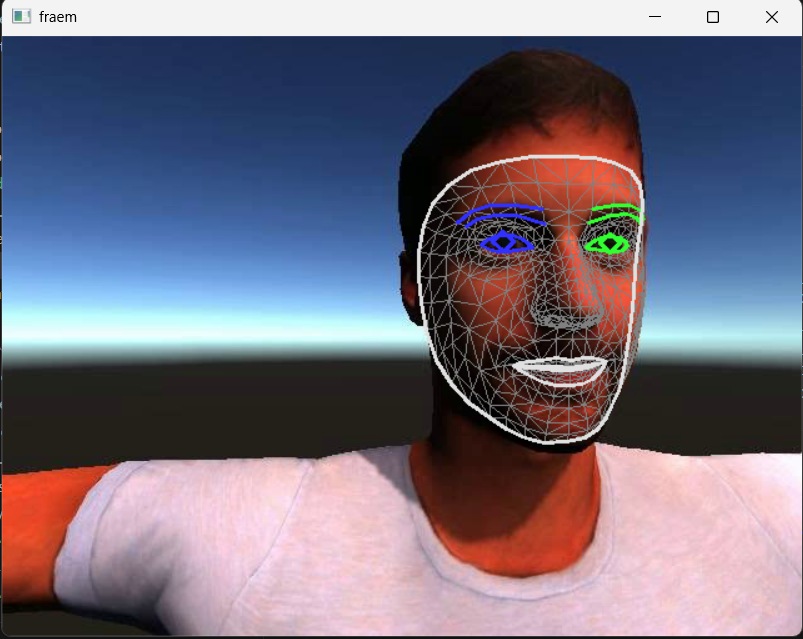

## Generator

from 2 camera feeds, we need a standard for placing the wearable.
Lets start with spectacles.
For this, we need the entire facial structure. and understanding of how augmented reality works.

Now the camera feeds are coming, we should try to integrate these 2 frames to find all the required data

## 3D model generation
triangulation:
https://www.youtube.com/watch?v=t3LOey68Xpg

In order to do triangulation and get 3d points, its necessary to identify features in each image and create an accurate match between the images

## Possible Ways to do Feature matching

* ORB
* SIFT/SURF
 
## Todo:Test case: 
Check no of features possible using each of the above ways, possible match, how many are accurate.

## Facial Landmark detection

this it the output of facial landmark detection given by mediapipe, we can use these data from both the frames and use triangulation to get the 3d model.

