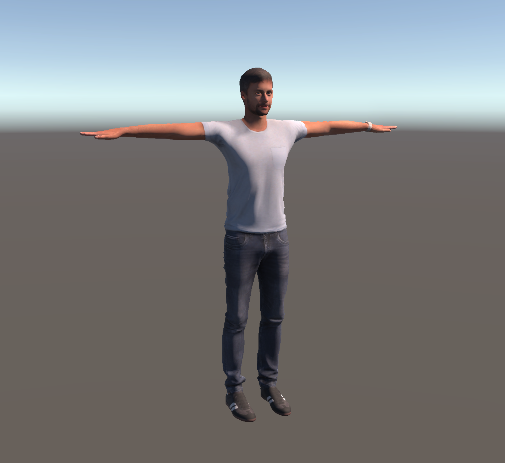
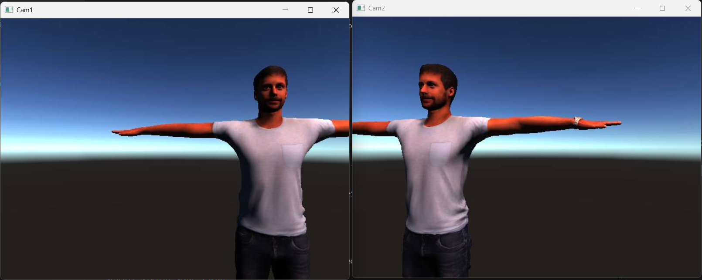

## Simulator
Run the My Project.exe file to start the simulation

Then run the CameraFeed.py to the camera feeds, that you will get through tcp stream.

Use this stream to do Augmented reality on it.
